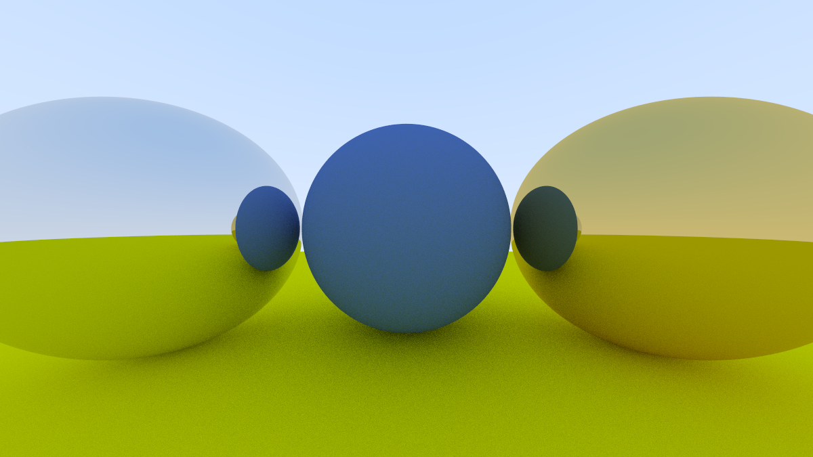
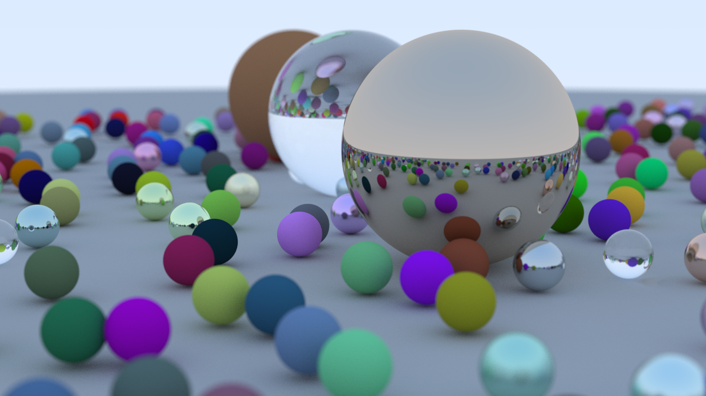
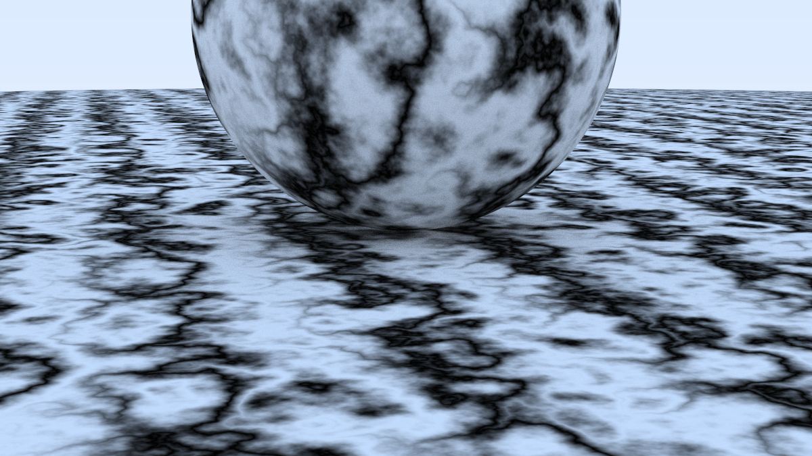
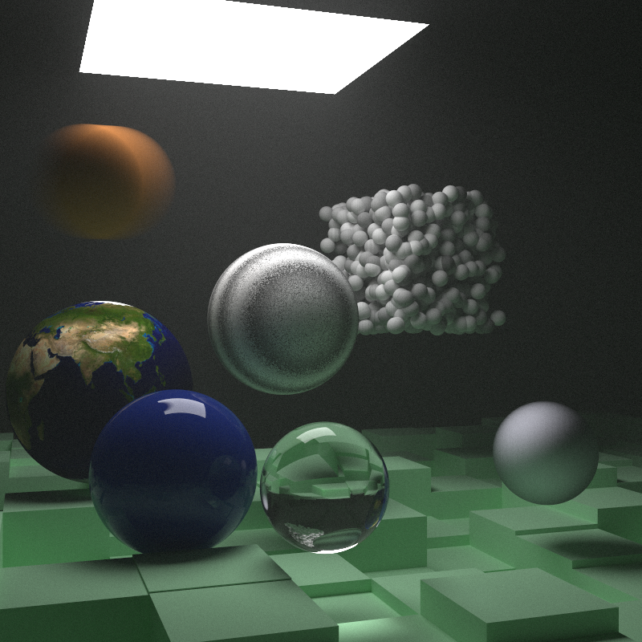
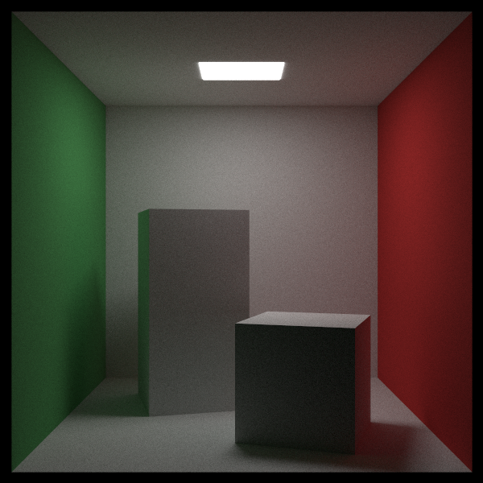

# Ray Tracing

A personal Rust version of [*Ray Tracing in One Weekend series*](https://raytracing.github.io/), which rebuilds the original C++ ray tracer into an Rust one.

## Illustration

The followings are some sample outputs generated along the development







## Usage

```sh
cargo run --release
```

or choose an example scene

```sh
cargo run --release --example render -- <scene>
```

where `<scene>` is one of: `bounding`, `checker`, `earth`, `perlin`, `quads`, `light`, `cornell`, `smoke`, `final`, `hq`. Defaults to `final`.

The rendered image is written to `./data/out.ppm`.

## References

[_Ray Tracing in One Weekend_](https://raytracing.github.io/books/RayTracingInOneWeekend.html)

[_Ray Tracing: The Next Week_](https://raytracing.github.io/books/RayTracingTheNextWeek.html)

[_Ray Tracing: The Rest of Your Life_](https://raytracing.github.io/books/RayTracingTheRestOfYourLife.html)
